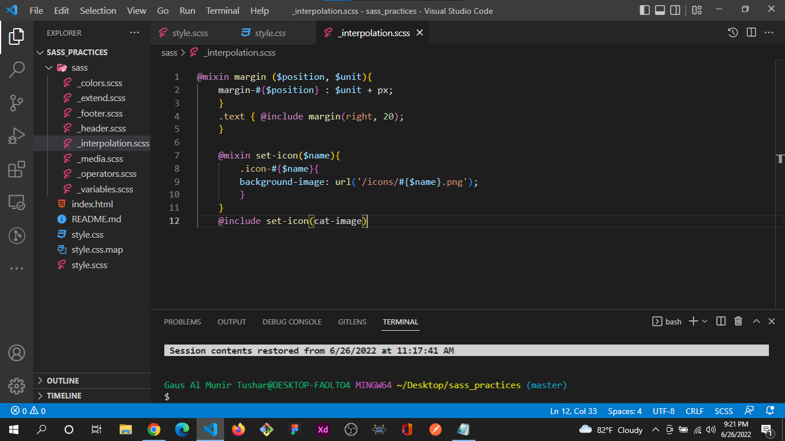

# 100 Days of Code @GausAlMunirTushar
## Day 1: #100DaysOfCode
Today I start a new Journey. I've learned different kinds of tools and techniques. 
Today I Learned & Practices:
- Tailwind CSS
- Vite (Tool)
- PostCSS (Tool)
- Also, Practice CSS Advanced Concepts

---
## Day 2 of : #100DaysOfCode
Today I learned JavaScript, TailwindCSS different kinds of tools and techniques. 
Today's Practices:
- Tailwind CSS 
- Responsive Design Practices
- NPM
- Also, Facebook Login UI Practices Project

---
## Day 3 of : #100DaysOfCode
Today I learned JavaScript, sass different kinds of tools and techniques. 
Today's Practices:
- CSS Flex
- Responsive Design Practices
- sass (variables, nesting, mixin)

## Day 4 of : #100DaysOfCode
Today I learned Sass, Nodejs, Tailwind CSS different kinds of tools and techniques. 
Today's Practices:
- Sass (Operators,Intepolation,)
- Tailwind CSS Advanced Concepts
- Tailwind CSS V3
- Node js basic
- Started Java Coding for Tomorrow's Midterm Exam

## Day 5 of : #100DaysOfCode
Today I learned Bem Methodology, Nodejs, Tailwind CSS different kinds of tools. 
Today's Practices:
- Bem Methodology(Block Element Modifier)
- Node js Modules
- JavaScript Intermediate Practices
- Node js basic
## Day 6 of : #100DaysOfCode
Today I learned Docker, Nodejs, and Bootstrap. 
Today's Practices:
- Dockerfile, 
- Docker Image, Container 
- Bootstrap Basic
- Node js basic
#javascript #Nodejs #Coding #Dockerfile

## Day 7 of : #100DaysOfCode
Today I learned Docker, JSON 
Today's Practices:
- Dockerfile, 
- Docker Image, Container 
- JSON Basic
- JSON with JavaScript
#javascript #Nodejs #Coding #Dockerfile
