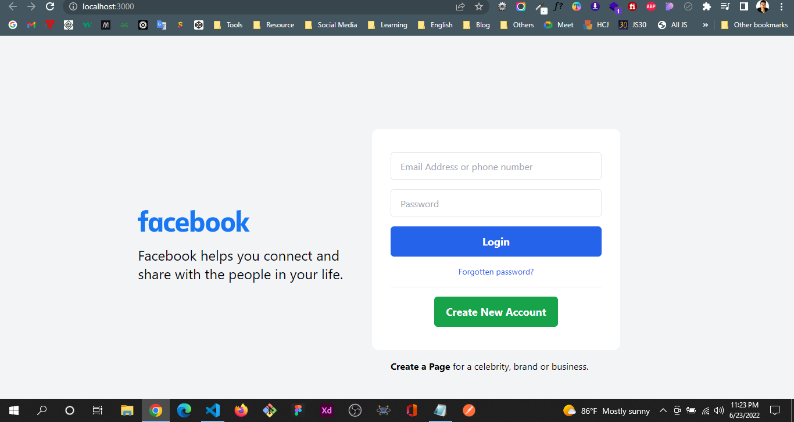
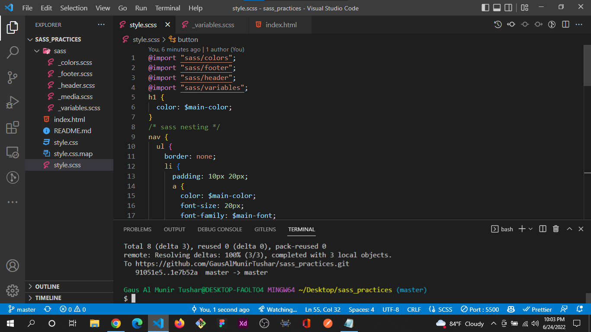

# 100 Days of Code @GausAlMunirTushar
## Day 1: #100DaysOfCode
Today I start a new Journey. I've learned different kinds of tools and techniques. 
Today I Learned & Practices:
- Tailwind CSS
- Vite (Tool)
- PostCSS (Tool)
- Also, Practice CSS Advanced Concepts

---
## Day 2 of : #100DaysOfCode
Today I learned JavaScript, TailwindCSS different kinds of tools and techniques. 
Today's Practices:
- Tailwind CSS 
- Responsive Design Practices
- NPM
- Also, Facebook Login UI Practices Project

---
## Day 3 of : #100DaysOfCode
Today I learned JavaScript, sass different kinds of tools and techniques. 
Today's Practices:
- CSS Flex
- Responsive Design Practices
- sass (variables, nesting, mixin)

