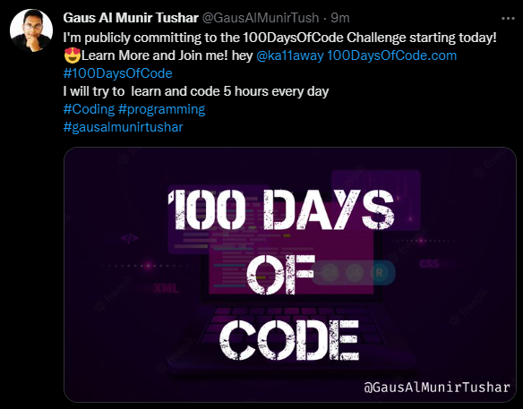
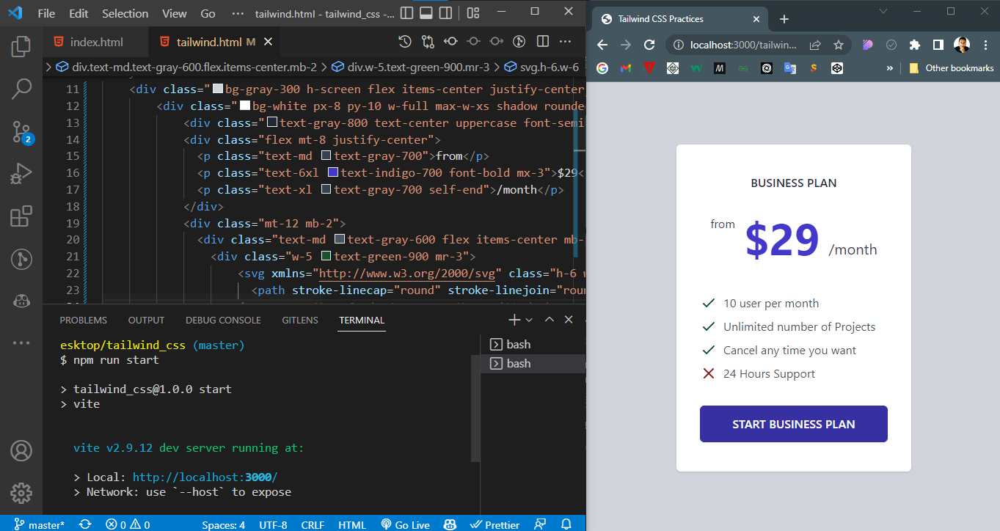

# 100 Days of Code

## Day 1: #100DaysOfCode
Today I start a new Journey. I've learned different kinds of tools and techniques. 
Today I Learned & Practices:
- Tailwind CSS
- Vite (Tool)
- PostCSS (Tool)
- Also, Practice CSS Advanced Concepts

---
## Day 2 of : #100DaysOfCode